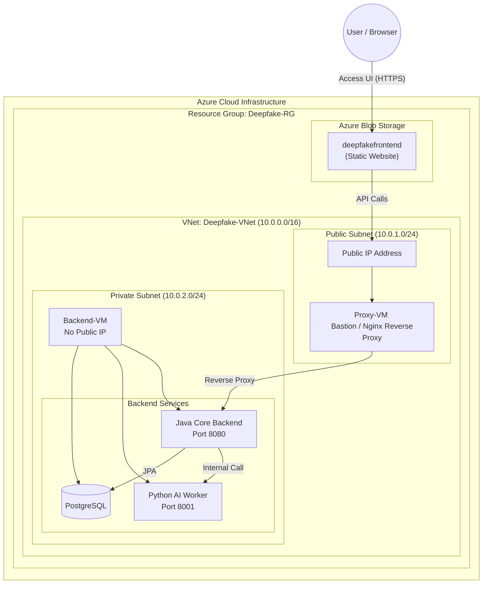
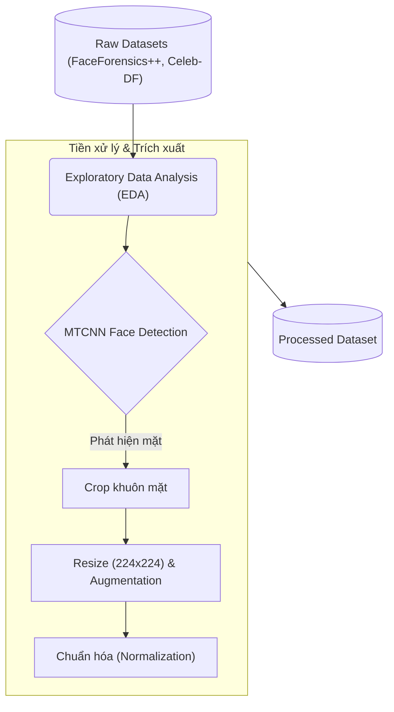
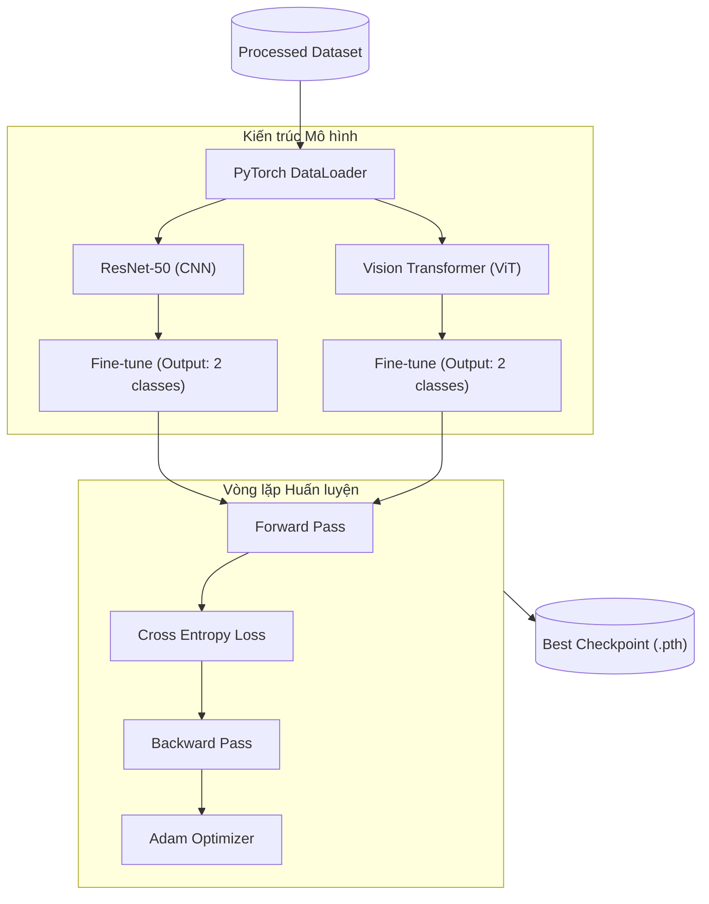
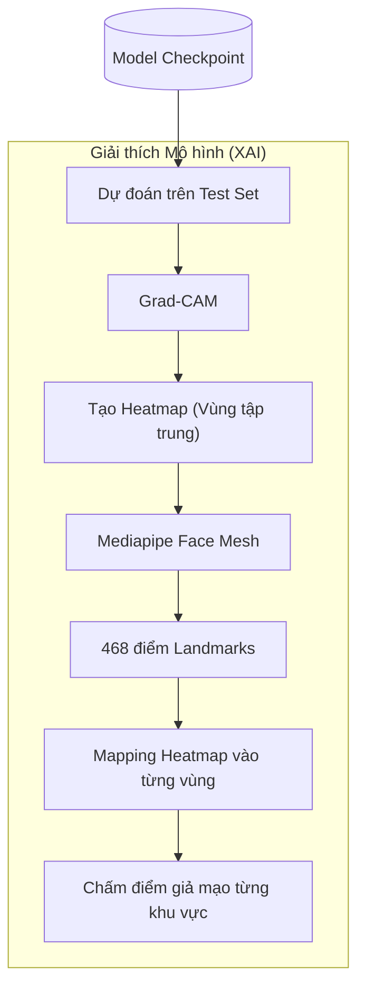

# 🎭 Deepfake Detection & Face Anti-Spoofing Platform (Microservices Architecture)

[](https://spring.io/projects/spring-boot)
[](https://fastapi.tiangolo.com/)
[](https://nextjs.org/)
[](https://pytorch.org/)

Đồ án cuối kỳ môn Deep Learning. Dự án xây dựng một hệ thống AI End-to-End có khả năng phân biệt ảnh chụp người thật và ảnh bị thao túng (Deepfake/GAN-generated). Hệ thống so sánh trực tiếp hiệu năng giữa 2 kiến trúc kinh điển: **CNN (ResNet-50)** và **Vision Transformer (ViT)**, đồng thời ứng dụng **Explainable AI (XAI)** kết hợp Mediapipe Face Mesh để trực quan hóa phán đoán của mô hình theo từng vùng khuôn mặt.

Hệ thống được thiết kế theo chuẩn **Microservices (Vi dịch vụ)**, tách biệt hoàn toàn phần xử lý nghiệp vụ (Java Spring Boot) và phần suy luận AI (Python FastAPI Worker), cùng với giao diện Frontend hiện đại xây dựng trên nền tảng Next.js.

---

## ✨ Tính năng Nổi bật (Core Features)

* 🏢 **Microservices Architecture:** 
  * **Core Backend (Java Spring Boot):** Hoạt động như API Gateway, nhận yêu cầu từ Frontend, quản lý File IO và Database thông qua JPA, có tính năng dọn dẹp rác (Garbage Collector) tự động bằng cron job.
  * **AI Worker (Python FastAPI):** Vi dịch vụ xử lý ảnh bất đồng bộ, kết hợp cơ chế `inference_lock` bảo vệ VRAM (GPU/CPU) khi chạy song song nhiều luồng request.
* 🖥️ **Modern Frontend (Next.js):** Giao diện UI/UX tương tác trực quan với các biểu đồ Radar Chart và Progress Bar thông qua Recharts và Zustand State Management.
* 🧠 **Dual-Model Inference:** Đánh giá đồng thời khuôn mặt qua ResNet (bắt lỗi pixel cục bộ) và ViT (bắt lỗi không gian toàn cục).
* 🔍 **Explainable AI (XAI) & Landmarks Analytics:** Cung cấp Heatmap (Grad-CAM) kết hợp 468 điểm tọa độ khuôn mặt của Mediapipe để bóc tách độ uy tín (Confidence) theo từng vùng: Mắt, Miệng, Vùng da.
* 🛡️ **Robust Data Pipeline:** Sử dụng `MTCNN` trích xuất khuôn mặt, kết hợp xử lý song song và catch Exception chi tiết.

---

## 👥 Đội ngũ Phát triển (Team Roles & Alignment)

* **Huỳnh Minh Trí (Cloud Architect & Core Backend):** Thiết lập hạ tầng Azure (Hub-Spoke, Bastion, Blob Storage). Code API Gateway và nghiệp vụ bằng **Java Spring Boot**, quản lý Database qua JPA. Đảm bảo giao tiếp REST mượt mà với AI Worker.
* **Phạm Duy Hoàng (Data Pipeline & ViT Specialist):** Xử lý tiền kỳ ảnh (MTCNN). Xây dựng, huấn luyện mô hình ViT và logic trích xuất Attention Map. Tích hợp pipeline này thành API Endpoint trong **FastAPI**.
* **Hứa Thị Ngọc Huyền (CNN Specialist & Frontend Dev):** Cấu hình và fine-tune ResNet-50. Viết thuật toán Grad-CAM và kết hợp Mediapipe XAI. Tích hợp endpoint vào **FastAPI**. Xây dựng toàn bộ giao diện UI bằng **Next.js** gọi lên server Java.
* **Võ Lê Khánh Linh (Data Analyst & Evaluation Lead):** Phân tích dữ liệu gốc (EDA). Benchmark so sánh Trade-off giữa ViT và ResNet. Vẽ sơ đồ kiến trúc Microservices, Dataflow và tổng hợp báo cáo/slide cuối kỳ.

---

## 🏗️ Kiến Trúc Hệ Thống & ML Pipeline (Architecture & Dataflow)

*Chi tiết biểu đồ xem trong file tại `outputs/architecture/`*

### 1. Kiến Trúc Azure Cloud (Hub-Spoke & Bastion)


### 2. Machine Learning Pipeline (Deep Learning)

**Phase 1: Data Preprocessing & EDA**


**Phase 2: Model Training & Evaluation**


**Phase 3: Explainable AI (XAI)**


---

## 📂 Cấu trúc Dự án (Folder Structure)

```text
DeepLearning_Final/
├── core-backend/    # Mã nguồn Java Spring Boot (Controllers, Services, JPA, Exception Handler)
├── api/             # Mã nguồn Python FastAPI (Nội bộ suy luận AI, XAI, Region Analysis)
├── frontend/        # Mã nguồn giao diện người dùng Next.js (App Router, Tailwind, Zustand)
├── models/          # Load Weights (.pth) cho ResNet và ViT
├── notebooks/       # File Jupyter Notebook phục vụ EDA và test đánh giá Trade-off
├── outputs/         # Thư mục chứa các file đồ thị kiến trúc hệ thống và ML Pipeline
├── data/            # Thư mục lưu trữ Dataset thô (Ignored by Git)
├── .env             # File biến môi trường (Ignored by Git)
├── requirements.txt # Danh sách các thư viện Python
└── README.md
```

---

## 🚀 Hướng dẫn Cài đặt & Chạy (Setup Instructions)

### 1. AI Worker (Python FastAPI)
Tạo môi trường ảo và cài đặt thư viện:
```bash
python -m venv venv
venv\Scripts\activate  # Windows
pip install -r requirements.txt
```
* Chạy AI Worker: `python run_api.py` (Mở tại port 8001)

### 2. Core Backend (Java Spring Boot)
Yêu cầu: JDK 17+ và Maven. Đảm bảo cấu hình SQL trong `application.yml`.
```bash
cd core-backend
mvn spring-boot:run
```

### 3. Frontend (Next.js)
Yêu cầu: Node.js 18+.
```bash
cd frontend
npm install
npm run dev
```

---

## 📊 Bộ dữ liệu (Dataset)
Dự án sử dụng bộ dữ liệu **Real vs Fake Faces (StyleGAN3)**:
🔗 [Kaggle Dataset](https://www.kaggle.com/datasets/troykueh/real-vs-fake-faces-stylegan3/data)
Vui lòng tải dữ liệu về và đặt trong thư mục `data/`.
