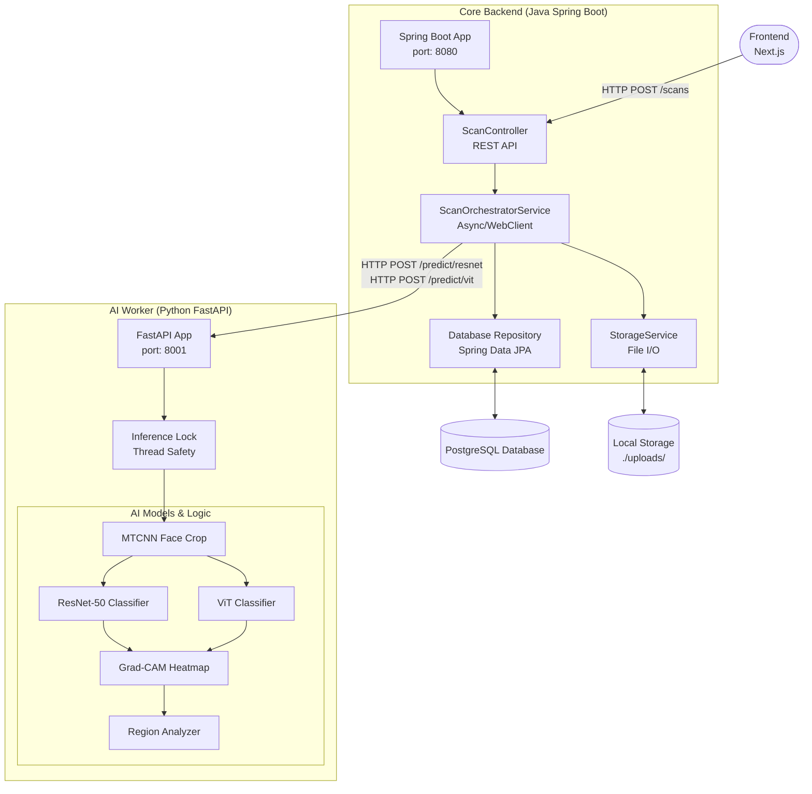

# Backend Architecture

```mermaid
graph TD
    %% Core Backend Components
    subgraph "Core Backend (Java Spring Boot)"
        A["Spring Boot App \n port: 8080"]
        B["ScanController \n REST API"]
        C["ScanOrchestratorService \n Async/WebClient"]
        D["StorageService \n File I/O"]
        E["Database Repository \n Spring Data JPA"]
        
        A --> B
        B --> C
        C --> D
        C --> E
    end

    %% AI Worker Components
    subgraph "AI Worker (Python FastAPI)"
        F["FastAPI App \n port: 8001"]
        G["Inference Lock \n Thread Safety"]
        
        subgraph "AI Models & Logic"
            H["MTCNN Face Crop"]
            I["ResNet-50 Classifier"]
            J["ViT Classifier"]
            K["Grad-CAM Heatmap"]
            L["Region Analyzer"]
        end

        F --> G
        G --> H
        H --> I
        H --> J
        I --> K
        J --> K
        K --> L
    end

    %% External Connections
    DB[("PostgreSQL Database")]
    Disk[("Local Storage \n ./uploads/")]
    Frontend(["Frontend \n Next.js"])

    %% Data Flow
    Frontend -- "HTTP POST /scans" --> B
    C -- "HTTP POST /predict/resnet \n HTTP POST /predict/vit" --> F
    E <--> DB
    D <--> Disk
```
