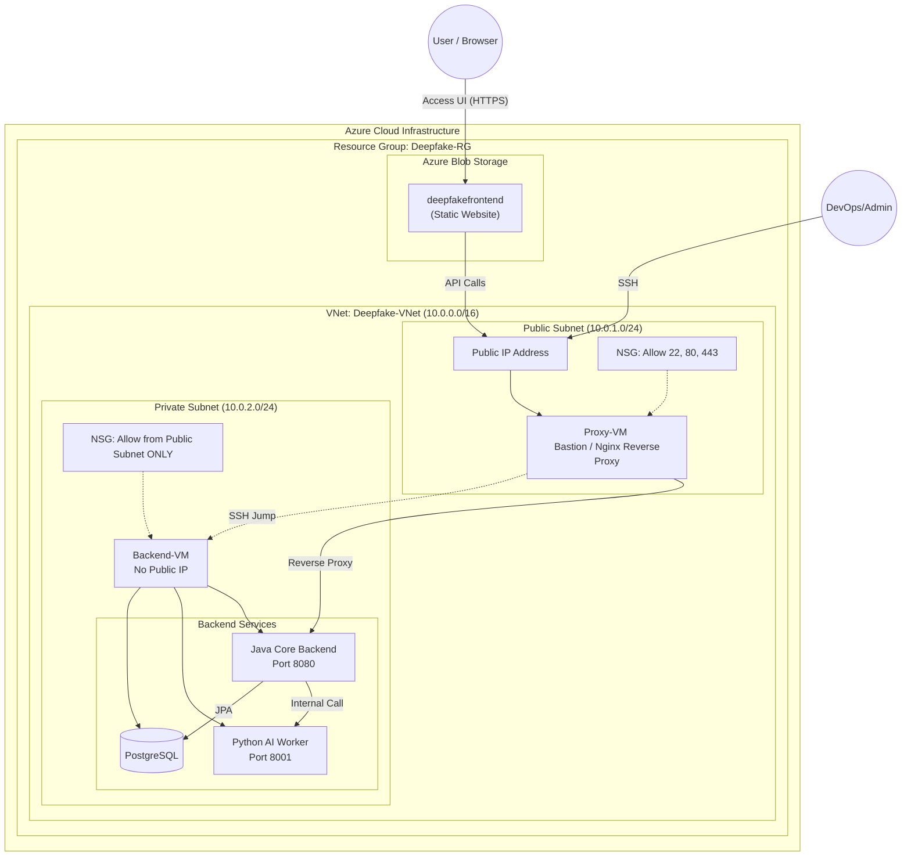

# Azure Cloud Architecture (ClickOps Model)

```mermaid
graph TD
    %% Internet & Users
    User((User / Browser))
    
    %% Azure Cloud
    subgraph "Azure Cloud Infrastructure"
        
        %% Resource Group
        subgraph "Resource Group: Deepfake-RG"
            
            %% Azure Storage
            subgraph "Azure Blob Storage"
                Blob["deepfakefrontend <br> (Static Website)"]
            end
            
            %% Virtual Network
            subgraph "VNet: Deepfake-VNet (10.0.0.0/16)"
                
                %% Public Subnet
                subgraph "Public Subnet (10.0.1.0/24)"
                    ProxyVM["Proxy-VM <br> Bastion / Nginx Reverse Proxy"]
                    PublicIP["Public IP Address"]
                    NSG1["NSG: Allow 22, 80, 443"]
                    
                    PublicIP --> ProxyVM
                    NSG1 -.-> ProxyVM
                end
                
                %% Private Subnet
                subgraph "Private Subnet (10.0.2.0/24)"
                    BackendVM["Backend-VM <br> No Public IP"]
                    NSG2["NSG: Allow from Public Subnet ONLY"]
                    
                    subgraph "Backend Services"
                        Java["Java Core Backend <br> Port 8080"]
                        Python["Python AI Worker <br> Port 8001"]
                        Postgres[("PostgreSQL")]
                    end
                    
                    BackendVM --> Java
                    BackendVM --> Python
                    BackendVM --> Postgres
                    NSG2 -.-> BackendVM
                end
            end
        end
    end
    
    %% Connections
    User -- "Access UI (HTTPS)" --> Blob
    Blob -- "API Calls" --> PublicIP
    ProxyVM -- "Reverse Proxy" --> Java
    Java -- "Internal Call" --> Python
    Java -- "JPA" --> Postgres
    
    %% SSH Flow
    Admin((DevOps/Admin))
    Admin -- "SSH" --> PublicIP
    ProxyVM -. "SSH Jump" .-> BackendVM
```
