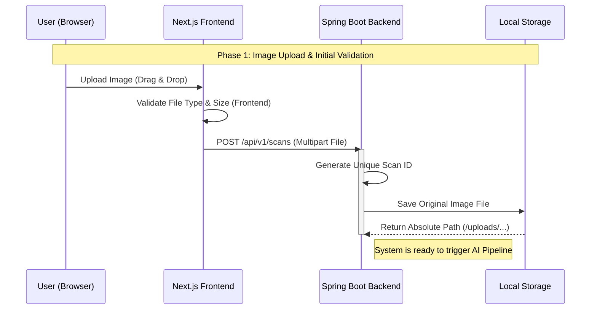

# Phase 1: Image Upload & Storage

```mermaid
sequenceDiagram
    participant User as User (Browser)
    participant UI as Next.js Frontend
    participant Java as Spring Boot Backend
    participant Disk as Local Storage

    Note over User, Disk: Phase 1: Image Upload & Initial Validation
    
    User->>UI: Upload Image (Drag & Drop)
    UI->>UI: Validate File Type & Size (Frontend)
    UI->>Java: POST /api/v1/scans (Multipart File)
    
    activate Java
    Java->>Java: Generate Unique Scan ID
    Java->>Disk: Save Original Image File
    Disk-->>Java: Return Absolute Path (/uploads/...)
    deactivate Java
    
    Note right of Java: System is ready to trigger AI Pipeline
```
