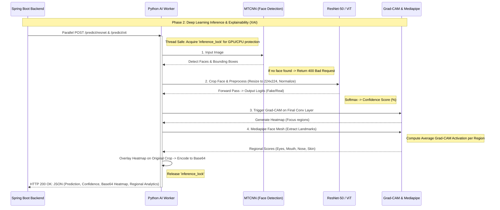

# Phase 2: Deep Learning Inference Pipeline (XAI & Prediction)

```mermaid
sequenceDiagram
    participant Java as Spring Boot Backend
    participant FastAPI as Python AI Worker
    participant MTCNN as MTCNN (Face Detection)
    participant Model as ResNet-50 / ViT
    participant XAI as Grad-CAM & Mediapipe

    Note over Java, XAI: Phase 2: Deep Learning Inference & Explainability (XAI)
    
    Java->>FastAPI: Parallel POST /predict/resnet & /predict/vit
    
    activate FastAPI
    Note right of FastAPI: Thread Safe: Acquire 'inference_lock' for GPU/CPU protection
    
    %% Face Detection
    FastAPI->>MTCNN: 1. Input Image
    MTCNN-->>FastAPI: Detect Faces & Bounding Boxes
    Note right of MTCNN: If no face found -> Return 400 Bad Request
    
    %% Classification
    FastAPI->>Model: 2. Crop Face & Preprocess (Resize to 224x224, Normalize)
    Model-->>FastAPI: Forward Pass -> Output Logits (Fake/Real)
    Note right of Model: Softmax -> Confidence Score (%)
    
    %% Explainable AI (XAI)
    FastAPI->>XAI: 3. Trigger Grad-CAM on Final Conv Layer
    XAI-->>FastAPI: Generate Heatmap (Focus regions)
    
    %% Landmark Analytics
    FastAPI->>XAI: 4. Mediapipe Face Mesh (Extract Landmarks)
    Note right of XAI: Compute Average Grad-CAM Activation per Region
    XAI-->>FastAPI: Regional Scores (Eyes, Mouth, Nose, Skin)
    
    %% Response
    FastAPI->>FastAPI: Overlay Heatmap on Original Crop -> Encode to Base64
    Note right of FastAPI: Release 'inference_lock'
    FastAPI-->>Java: HTTP 200 OK: JSON (Prediction, Confidence, Base64 Heatmap, Regional Analytics)
    deactivate FastAPI
```
