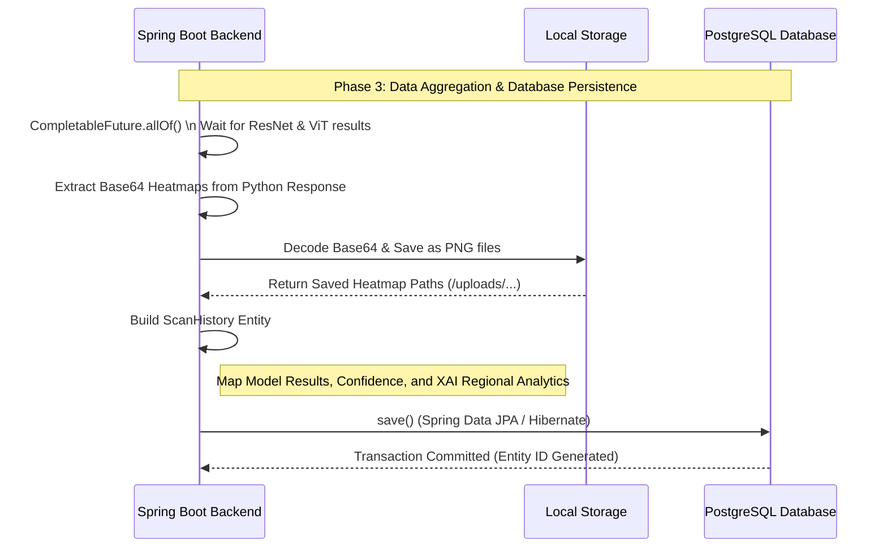

# Phase 3: Data Aggregation & Persistence

```mermaid
sequenceDiagram
    participant Java as Spring Boot Backend
    participant Disk as Local Storage
    participant DB as PostgreSQL Database

    Note over Java, DB: Phase 3: Data Aggregation & Database Persistence
    
    Java->>Java: CompletableFuture.allOf() \n Wait for ResNet & ViT results
    
    %% Base64 Decoding & Image Saving
    Java->>Java: Extract Base64 Heatmaps from Python Response
    Java->>Disk: Decode Base64 & Save as PNG files
    Disk-->>Java: Return Saved Heatmap Paths (/uploads/...)
    
    %% Database Transaction
    Java->>Java: Build ScanHistory Entity
    Note right of Java: Map Model Results, Confidence, and XAI Regional Analytics
    Java->>DB: save() (Spring Data JPA / Hibernate)
    DB-->>Java: Transaction Committed (Entity ID Generated)
```
