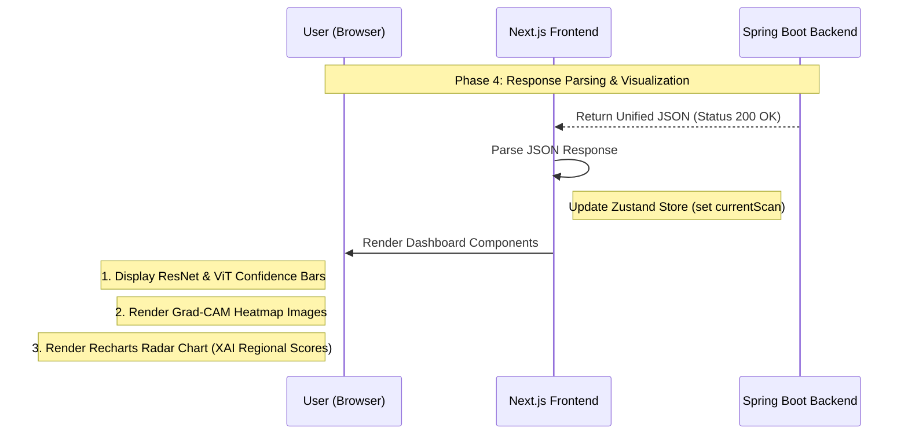

# Phase 4: UI Update & Visualization

```mermaid
sequenceDiagram
    participant User as User (Browser)
    participant UI as Next.js Frontend
    participant Java as Spring Boot Backend

    Note over User, Java: Phase 4: Response Parsing & Visualization
    
    Java-->>UI: Return Unified JSON (Status 200 OK)
    
    %% State Update
    UI->>UI: Parse JSON Response
    Note right of UI: Update Zustand Store (set currentScan)
    
    %% Rendering
    UI->>User: Render Dashboard Components
    Note left of User: 1. Display ResNet & ViT Confidence Bars
    Note left of User: 2. Render Grad-CAM Heatmap Images
    Note left of User: 3. Render Recharts Radar Chart (XAI Regional Scores)
```
