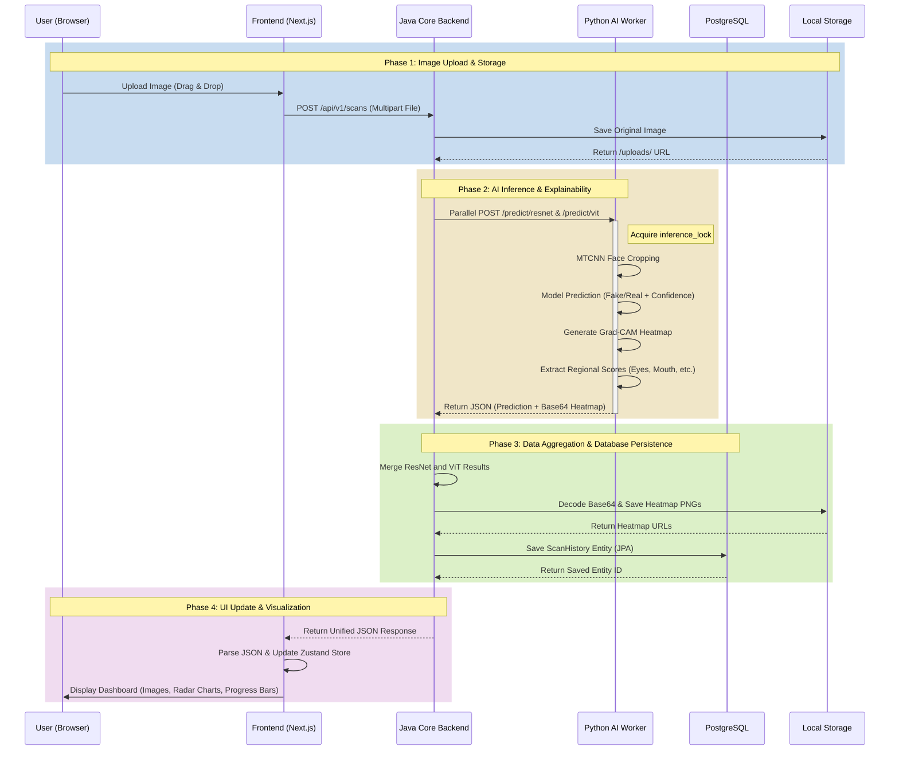

# Dataflow Phases

```mermaid
sequenceDiagram
    participant User as User (Browser)
    participant UI as Frontend (Next.js)
    participant Java as Java Core Backend
    participant Python as Python AI Worker
    participant DB as PostgreSQL
    participant Disk as Local Storage

    %% Phase 1: Upload & Initial Processing
    rect rgb(200, 220, 240)
    Note over User, Disk: Phase 1: Image Upload & Storage
    User->>UI: Upload Image (Drag & Drop)
    UI->>Java: POST /api/v1/scans (Multipart File)
    Java->>Disk: Save Original Image
    Disk-->>Java: Return /uploads/ URL
    end

    %% Phase 2: Parallel AI Inference
    rect rgb(240, 230, 200)
    Note over Java, Python: Phase 2: AI Inference & Explainability
    Java->>Python: Parallel POST /predict/resnet & /predict/vit
    
    activate Python
    Note right of Python: Acquire inference_lock
    Python->>Python: MTCNN Face Cropping
    Python->>Python: Model Prediction (Fake/Real + Confidence)
    Python->>Python: Generate Grad-CAM Heatmap
    Python->>Python: Extract Regional Scores (Eyes, Mouth, etc.)
    Python-->>Java: Return JSON (Prediction + Base64 Heatmap)
    deactivate Python
    end

    %% Phase 3: Aggregation & Persistence
    rect rgb(220, 240, 200)
    Note over Java, DB: Phase 3: Data Aggregation & Database Persistence
    Java->>Java: Merge ResNet and ViT Results
    Java->>Disk: Decode Base64 & Save Heatmap PNGs
    Disk-->>Java: Return Heatmap URLs
    Java->>DB: Save ScanHistory Entity (JPA)
    DB-->>Java: Return Saved Entity ID
    end

    %% Phase 4: Response & Visualization
    rect rgb(240, 220, 240)
    Note over Java, User: Phase 4: UI Update & Visualization
    Java-->>UI: Return Unified JSON Response
    UI->>UI: Parse JSON & Update Zustand Store
    UI->>User: Display Dashboard (Images, Radar Charts, Progress Bars)
    end
```
