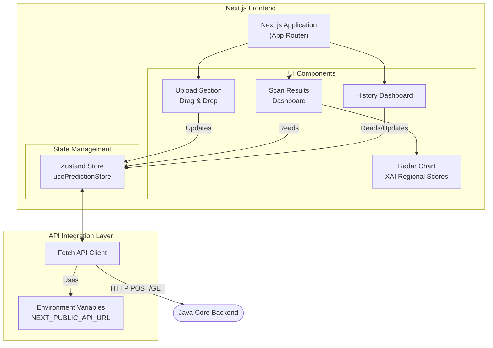

# Frontend Architecture

```mermaid
graph TD
    %% Next.js Application Architecture
    subgraph "Next.js Frontend"
        A["Next.js Application <br> (App Router)"]
        
        subgraph "UI Components"
            B["Upload Section <br> Drag & Drop"]
            C["Scan Results <br> Dashboard"]
            D["History Dashboard"]
            E["Radar Chart <br> XAI Regional Scores"]
        end
        
        subgraph "State Management"
            F["Zustand Store <br> usePredictionStore"]
        end
        
        A --> B
        A --> C
        A --> D
        C --> E
        
        B -- "Updates" --> F
        C -- "Reads" --> F
        D -- "Reads/Updates" --> F
    end
    
    %% API Integrations
    subgraph "API Integration Layer"
        G["Fetch API Client"]
        H["Environment Variables <br> NEXT_PUBLIC_API_URL"]
    end
    
    F <--> G
    G -- "Uses" --> H
    
    %% Backend Connection
    Z(["Java Core Backend"])
    G -- "HTTP POST/GET" --> Z
```
