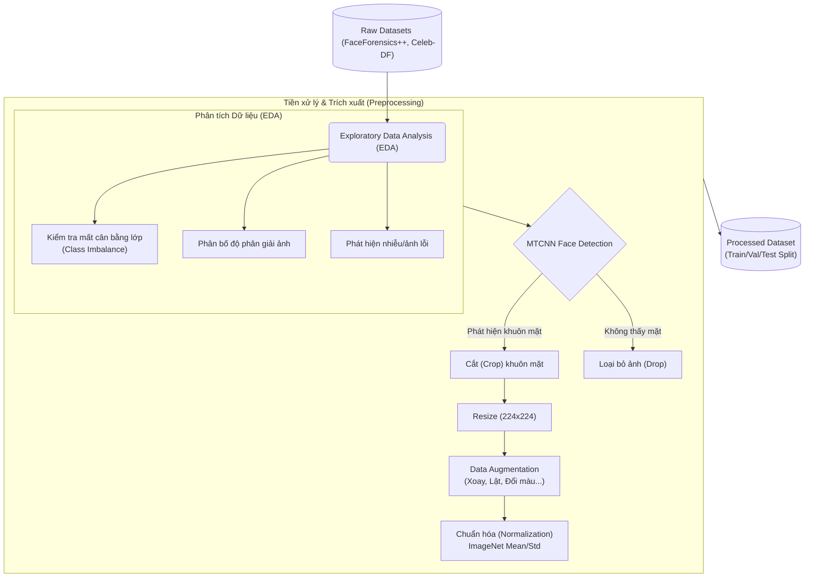

# ML Phase 1: Data Preprocessing & EDA

```mermaid
graph TD
    %% Dataset Collection
    A[("Raw Datasets <br> (FaceForensics++, Celeb-DF)")] --> B("Exploratory Data Analysis (EDA)")
    
    %% EDA
    subgraph EDA ["Phân tích Dữ liệu (EDA)"]
        B --> B1["Kiểm tra mất cân bằng lớp <br> (Class Imbalance)"]
        B --> B2["Phân bố độ phân giải ảnh"]
        B --> B3["Phát hiện nhiễu/ảnh lỗi"]
    end
    
    %% Data Cleaning & Extraction
    subgraph Preprocessing ["Tiền xử lý & Trích xuất (Preprocessing)"]
        EDA --> C{"MTCNN Face Detection"}
        C -- "Phát hiện khuôn mặt" --> D["Cắt (Crop) khuôn mặt"]
        C -- "Không thấy mặt" --> E["Loại bỏ ảnh (Drop)"]
        
        D --> F["Resize (224x224)"]
        F --> G["Data Augmentation <br> (Xoay, Lật, Đổi màu...)"]
        G --> H["Chuẩn hóa (Normalization) <br> ImageNet Mean/Std"]
    end
    
    Preprocessing --> Output[("Processed Dataset <br> (Train/Val/Test Split)")]
```
