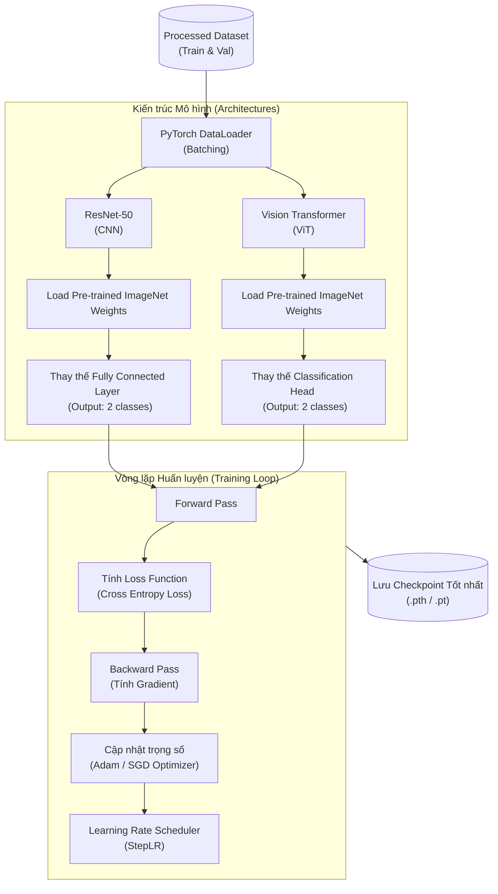

# ML Phase 2: Model Architecture & Training

```mermaid
graph TD
    Input[("Processed Dataset <br> (Train & Val)")] --> Dataloader["PyTorch DataLoader <br> (Batching)"]
    
    subgraph Architectures ["Kiến trúc Mô hình (Architectures)"]
        Dataloader --> ResNet["ResNet-50 <br> (CNN)"]
        Dataloader --> ViT["Vision Transformer <br> (ViT)"]
        
        %% Transfer Learning
        ResNet --> Freeze1["Load Pre-trained ImageNet Weights"]
        ViT --> Freeze2["Load Pre-trained ImageNet Weights"]
        
        Freeze1 --> FineTune1["Thay thế Fully Connected Layer <br> (Output: 2 classes)"]
        Freeze2 --> FineTune2["Thay thế Classification Head <br> (Output: 2 classes)"]
    end
    
    subgraph TrainingLoop ["Vòng lặp Huấn luyện (Training Loop)"]
        FineTune1 --> Forward["Forward Pass"]
        FineTune2 --> Forward
        
        Forward --> Loss["Tính Loss Function <br> (Cross Entropy Loss)"]
        Loss --> Backward["Backward Pass <br> (Tính Gradient)"]
        Backward --> Optimizer["Cập nhật trọng số <br> (Adam / SGD Optimizer)"]
        Optimizer --> Sched["Learning Rate Scheduler <br> (StepLR)"]
    end
    
    TrainingLoop --> Checkpoint[("Lưu Checkpoint Tốt nhất <br> (.pth / .pt)")]
```
