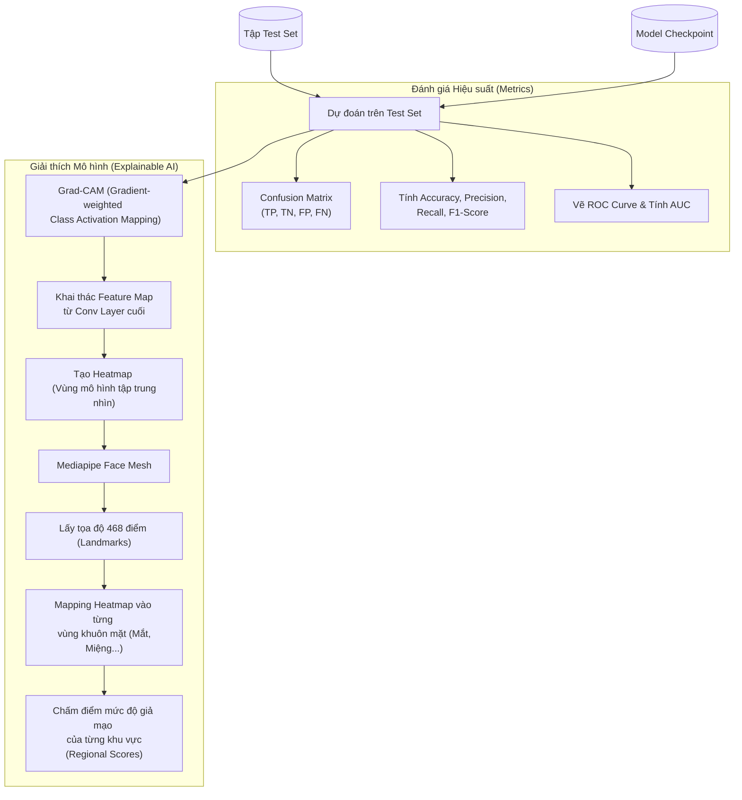

# ML Phase 3: Evaluation & Explainable AI (XAI)

```mermaid
graph TD
    TestSet[("Tập Test Set")] --> Inference["Dự đoán trên Test Set"]
    Checkpoint[("Model Checkpoint")] --> Inference
    
    subgraph Metrics ["Đánh giá Hiệu suất (Metrics)"]
        Inference --> ConfMatrix["Confusion Matrix <br> (TP, TN, FP, FN)"]
        Inference --> Scores["Tính Accuracy, Precision, <br> Recall, F1-Score"]
        Inference --> ROCCurve["Vẽ ROC Curve & Tính AUC"]
    end
    
    subgraph XAI ["Giải thích Mô hình (Explainable AI)"]
        Inference --> GradCAM["Grad-CAM (Gradient-weighted <br> Class Activation Mapping)"]
        GradCAM --> ConvLayer["Khai thác Feature Map <br> từ Conv Layer cuối"]
        ConvLayer --> Heatmap["Tạo Heatmap <br> (Vùng mô hình tập trung nhìn)"]
        
        Heatmap --> Mediapipe["Mediapipe Face Mesh"]
        Mediapipe --> Landmarks["Lấy tọa độ 468 điểm (Landmarks)"]
        Landmarks --> Mapping["Mapping Heatmap vào từng <br> vùng khuôn mặt (Mắt, Miệng...)"]
        Mapping --> RegionalScores["Chấm điểm mức độ giả mạo <br> của từng khu vực (Regional Scores)"]
    end
```
