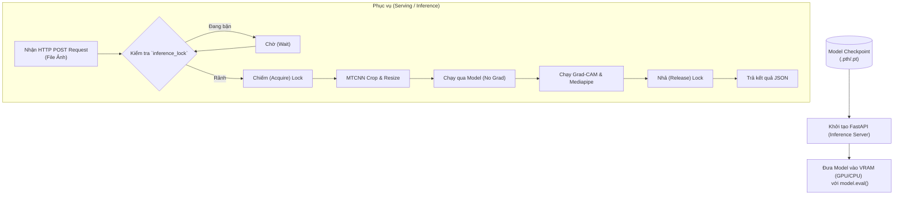

# ML Phase 4: Deployment & Serving

```mermaid
graph TD
    Checkpoint[("Model Checkpoint <br> (.pth/.pt)")] --> API["Khởi tạo FastAPI (Inference Server)"]
    API --> GPU["Đưa Model vào VRAM (GPU/CPU) <br> với model.eval()"]
    
    subgraph Serving ["Phục vụ (Serving / Inference)"]
        Request["Nhận HTTP POST Request <br> (File Ảnh)"] --> Lock{"Kiểm tra `inference_lock`"}
        
        Lock -- "Đang bận" --> Wait["Chờ (Wait)"]
        Wait --> Lock
        
        Lock -- "Rảnh" --> Exec["Chiếm (Acquire) Lock"]
        
        Exec --> Preprocess["MTCNN Crop & Resize"]
        Preprocess --> Forward["Chạy qua Model (No Grad)"]
        Forward --> Explain["Chạy Grad-CAM & Mediapipe"]
        
        Explain --> Release["Nhả (Release) Lock"]
        Release --> Response["Trả kết quả JSON"]
    end
```
